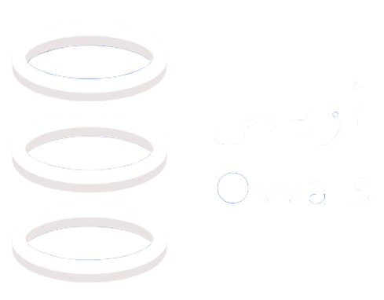

# owais-app

<!--lint disable awesome-heading awesome-github awesome-toc double-link -->

   
  
   
   

<h2 align='center'>Owais App</h2>

## Live URL

- https://owais-app-f9fe3.web.app/

## Get Started

- [clone code] - Through git bash or simply download the zip code.
- [install node_modules] - npm install.

### Run Project

- [npm run dev] -
